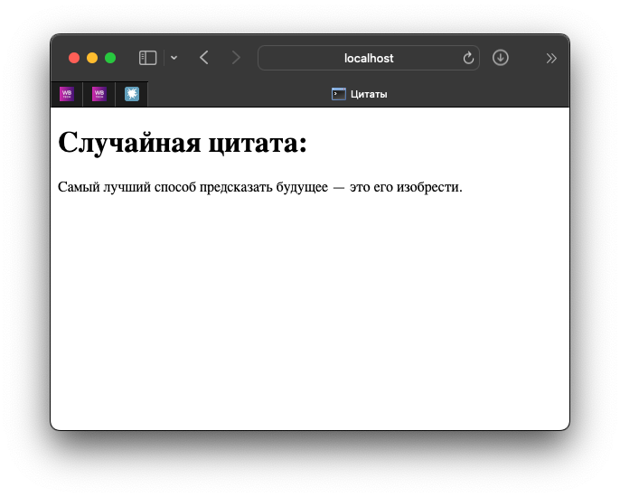

### Задание 3 - Оркестрация приложений - docker compose

- необходимо реализовать многоконтейнерное приложение с использованием docker compose
- отдельные контейнеры должны взаимодействовать между собой через файловую систему или сеть
- контейнеры не должны совпадать с контейнерами из задания 2
- в отчёт необходимо добавить код приложений, команды на запуск контейнеров и ссылку на образ (hub.docker.com/...)

### Решение

Было сделано многоконтейнерное приложение с использованием docker compose. 
В данном приложении есть 2 контейнера:
- flask_frontend - приложение на python с использованием фреймворка Flask, который используется для отображения html страницы
- fastapi_service - приложение на python с использованием фреймворка FastAPI, который используется для рандомного вывода цитаты

Когда пользователь заходит на страницу `http://localhost:5000/`, то он видит цитату, которая была получена с помощью запроса к fastapi_service.

#### Запуск 

`docker compose up --build -d`

#### Ссылки на образы двух контейнеров

https://hub.docker.com/repository/docker/progerg/linux-project-3-flask_frontend/general
https://hub.docker.com/repository/docker/progerg/linux-project-3-fastapi_service/general

#### Код приложений
https://github.com/progerg/linux-project-3

